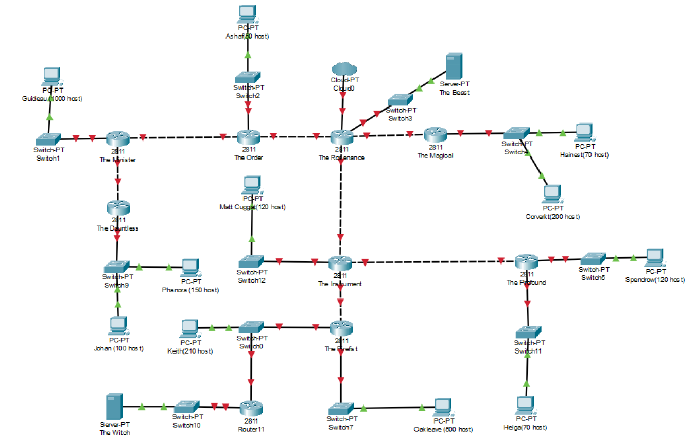
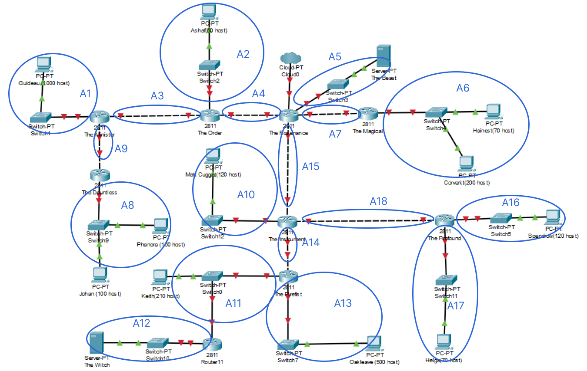

# Jarkom-Modul-4-F11-2022

### Kelompok F11

| **No** | **Nama** | **NRP** | 
| ------------- | ------------- | --------- |
| 1 | Ryo Hilmi Ridho  | 5025201192 | 
| 2 | Moh. Ilham Fakhri Zamzami | 5025201275 |
| 3 | Putu Andhika Pratama | 5025201132 |

## Topologi

## VLSM

### Subnetting

### Tabel Subnetting
| Subnet | Jumlah IP  | Netmask |
| --- | --- | --- |
| A1 | 1001 | /22 |
| A2 | 51 | /26 |
| A3 | 2 | /30 |
| A4 | 2 | /30 |
| A5 | 2 | /30 |
| A6 | 271 | /23 |
| A7 | 2 | /30 |
| A8 | 251 | /24 |
| A9 | 2 | /30 |
| A10 | 121 | /25 |
| A11 | 212 | /24 |
| A12 | 2 | /30 |
| A13 | 501 | /23 |
| A14 | 2 | /30 |
| A15 | 2 | /30 |
| A16 | 121 | /25 |
| A17 | 71 | /25 |
| A18 | 2 | /30 |
| Total | 2618 | /20 |

### Tree

### Pembagian IP
### Tabel Subnetting
| Subnet | Network ID  | Netmask |
| --- | --- | --- |
| A1 | 10.34.12.0 | 255.255.252.0 |
| A2 | 10.34.11.128 | 255.255.255.192 |
| A3 | 10.34.0.0 | 255.255.255.252 |
| A4 | 10.34.0.4 | 255.255.255.252 |
| A5 | 10.34.0.8 | 255.255.255.252 |
| A6 | 10.34.6.0 | 255.255.254.0 |
| A7 | 10.34.0.12 | 255.255.255.252 |
| A8 | 10.34.8.0 | 255.255.255.0 |
| A9 | 10.34.0.16 | 255.255.255.252 |
| A10 | 10.34.10.0 | 255.255.255.128 |
| A11 | 10.34.9.0 | 255.255.255.0 |
| A12 | 10.34.0.20 | 255.255.255.252 |
| A13 | 10.34.4.0 | 255.255.254.0 |
| A14 | 10.34.0.24 | 255.255.255.252 |
| A15 | 10.34.0.28 | 255.255.255.252 |
| A16 | 10.34.10.128 | 255.255.255.128 |
| A17 | 10.34.11.0 | 255.255.255.128 |
| A18 | 10.34.0.32 | 255.255.255.252 |